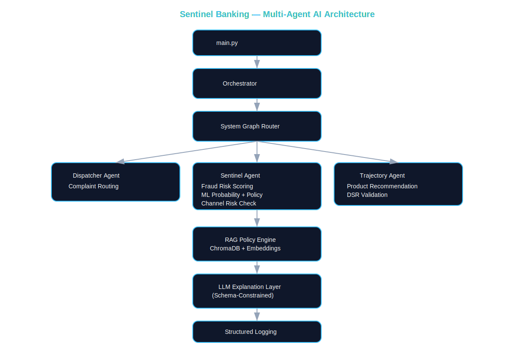

# Sentinnel Banking

**Multi-Agent AI System for Intelligent Banking Operations**



---

## Executive Summary

Sentinnel Banking is a modular, multi-agent artificial intelligence system built to enhance operational efficiency, risk management, and customer experience within a digital banking environment. It automates three core banking functions — complaint routing, fraud detection, and product recommendation — using a governance-first architecture where deterministic engines make every financial decision, and language models are used strictly to generate clear, audit-ready explanations.

| Agent | Function |
|---|---|
| **Dispatcher Agent** | Complaint classification, sentiment analysis, and department routing |
| **Sentinel Agent** | Hybrid fraud risk scoring combining ML probability with policy-based controls and channel-aware safeguards |
| **Trajectory Agent** | Product recommendation using structured eligibility rules, affordability checks, and policy validation |

**Key design characteristics:**

- Policy-aligned decision frameworks — deterministic logic, not AI guesswork
- Hybrid fraud detection — machine learning enhances, but never overrides, policy safeguards
- Channel-aware risk assessment (ATM, POS, Web, Mobile)
- Structured JSON logging for full audit traceability
- Modular multi-agent orchestration via LangGraph

All data used in development is synthetic and designed to simulate real banking workflows without exposing sensitive information.

---

## Core Design Philosophy

Sentinnel Banking is built on a strict five-layer architecture. Each layer has a defined role and is not permitted to exceed it:

```
1. Deterministic Decision Engines   ← owns every financial decision
2. Machine Learning                 ← fraud probability only (Sentinel Agent)
3. RAG Policy Grounding             ← validates decisions against policy docs
4. Schema-Constrained LLM           ← generates audit-ready explanations only
5. Structured Logging               ← full traceability per request
```

**LLMs do not make decisions. They explain decisions made by deterministic engines.**

---

## Agents

### Dispatcher Agent

Automates complaint classification and department routing, replacing manual ticket triage.

- Semantic and keyword-based routing across 15+ complaint categories
- SLA classification (24–96 hours by department)
- Department code mapping (TSU | COC | FRM | DCS | AOD | CLS)
- Policy-grounded explanation via RAG (POL-CCH-001)
- Priority level assignment (Critical → High → Medium → Low)

### Sentinel Agent

Evaluates every transaction through a hybrid fraud pipeline before funds are released.

**Fraud Pipeline:**

```
Transaction
  → Behavioural Feature Engineering   (7 ML features)
  → ML Fraud Probability              (RandomForest, model.pkl)
  → Policy Risk Scoring               (FRM-001 flag weights)
  → Merchant Risk Assessment          (FRM-002 category weights)
  → Channel Risk Layer                (ATM / POS / Web / Mobile)
  → Final Risk Score                  (0–100)
  → Action                            (Approve / OTP / Biometric / Block)
```

**ML Integration:** The fraud model learns behavioural transaction patterns and outputs `ml_probability` (0–1). An ML probability above 0.85 can escalate a LOW policy score to MEDIUM. The final decision always remains policy-controlled — ML enhances sensitivity without overriding governance.

**Channel Risk Layer:** ATM and POS transactions always trigger a push-to-app biometric challenge regardless of ML probability. Channel context can escalate actions even when the ML score is moderate.

| Risk Level | Score Range | Action |
|---|---|---|
| LOW | 0–30 | Process immediately |
| MEDIUM | 31–60 | Step-up OTP |
| HIGH | 61–85 | Push-to-app biometric |
| CRITICAL | 86–100 | Block and freeze |

### Trajectory Agent

Recommends eligible financial products based on a customer's Loan Signal Score and behavioural transaction history. Does not use machine learning — eligibility is determined by deterministic score thresholds validated against PRS-001 v2.1.

| Product | Score Floor | Score Ceiling | Primary Segment |
|---|---|---|---|
| Student Loan | 0.80 | 0.98 | Age 18–25, solo candidate |
| Car Loan | 0.75 | 0.95 | High mobility spend, salary detected |
| Investment Plan | 0.70 | 0.90 | Monthly inflow > ₦2M |
| Personal Loan | 0.70 | 0.92 | Salary detected, moderate inflow |
| Trust Fund | 0.65 | 0.85 | High balance, long-term profile |

---

## RAG Policy Engine

All three agents are grounded against a shared ChromaDB knowledge base using SentenceTransformers embeddings (`all-mpnet-base-v2`). RAG validates agent decisions against policy — it does not override deterministic logic.

| Policy Document | ID | Used By |
|---|---|---|
| Customer Complaint Handling | POL-CCH-001 | Dispatcher Agent |
| Fraud Detection Guidelines | FRM-001 | Sentinel Agent |
| Merchant Risk Profiles | FRM-002 | Sentinel Agent |
| Transaction Processing Policies | TSU-POL-002 | All agents |
| Product Recommendation Policy | PRS-001 v2.1 | Trajectory Agent |
| Customer FAQ | FAQ-001 | LLM explanation context |

---

## Logging & Traceability

Every agent decision produces a structured log entry persisted to PostgreSQL and written to local log files:

```
logs/
├── reasoning.log   ← full agent decision payload per request
└── system.log      ← system events and orchestrator lifecycle
```

Each entry captures: timestamp, agent name, request ID, RAG policy basis, ML score (where applicable), LLM explanation, and final decision. This enables complete audit traceability per transaction.

---

## Tech Stack

| Layer | Technology |
|---|---|
| API Framework | FastAPI (Python 3.13, async) |
| Database | PostgreSQL on Aiven (cloud-hosted, 16 tables) |
| ORM | SQLAlchemy (async) + asyncpg |
| AI Agents | LangChain + LangGraph |
| LLM | OpenAI GPT-4o (primary) · Google Gemini 2.5 Flash (fallback) |
| Auth | JWT (Jose) + bcrypt |
| Vector Store | ChromaDB + SentenceTransformers |
| ML | scikit-learn RandomForest + joblib |
| Frontend | React + Vite · Redux Toolkit · Tailwind CSS |
| Notifications | Resend (email) · Svix (webhooks) |

---

## Project Structure

```
Sentinnel_bank_project/
│
├── Backend/                        ← FastAPI API surface
│   ├── app.py                      ← Main FastAPI application entry point
│   ├── api.py                      ← Auth routes (/auth/*)
│   ├── models.py                   ← SQLAlchemy DB models (16 tables)
│   ├── schemas.py                  ← Pydantic request/response schemas
│   ├── database.py                 ← Async PostgreSQL connection
│   ├── middleware.py               ← JWT token guard
│   └── auth.py                     ← Password hashing (bcrypt) & JWT helpers
│
├── app/                            ← AI/ML orchestration layer
│   ├── agents/                     ← SentinelAgent, DispatcherAgent, TrajectoryAgent
│   ├── core/                       ← LangGraph orchestrator + AgentGraph routing
│   ├── prompts/                    ← LLM system prompts per agent
│   ├── rag/                        ← ChromaDB RAG pipeline + 6 policy documents
│   ├── ml/                         ← RandomForest model + feature engineering
│   ├── data/                       ← BankRepository + DatasetLoader (4 CSVs)
│   ├── evaluation/                 ← Metrics + LLM Judge evaluation harness
│   ├── logs/                       ← reasoning.log + system.log
│   └── utils/                      ← LLMClient, schemas, logger, policy generator
│
├── Frontend/                       ← React + Vite customer web application
│   └── src/
│       ├── api/axiosConfig.js      ← Centralised DAL, interceptors, Mock Engine
│       ├── components/             ← Layout, shared modals, admin modules
│       ├── features/               ← Redux Toolkit slices (authSlice, aiSlice, etc.)
│       ├── router/AppRouter.jsx    ← React Router DOM + protected route guards
│       ├── screens/                ← consumer/, admin/, auth/ screen views
│       └── store.js                ← Global Redux store
│
├── database/
│   ├── create_schema.py            ← Provisions all 16 tables on Aiven
│   └── README.md                   ← Database setup guide
│
├── docs/
│   └── architecture.svg            ← System architecture diagram
│
├── main.py                         ← AI agent demo runner
├── .env.example                    ← Environment variable template
├── requirements.txt
├── WORK_DISTRIBUTION.md
└── ONBOARDING.md
```

---

## Getting Started

### Prerequisites

- Python 3.11+ (3.13 used in project)
- Node.js 20+
- PostgreSQL (Aiven or compatible)

### 1 — Clone and install backend

```bash
git clone https://github.com/Cunyie08/genai_sentinel_banking_integration.git
cd genai_sentinel_banking_integration

python -m venv .venv
source .venv/bin/activate      # Mac / Linux
.venv\Scripts\activate         # Windows

pip install -r requirements.txt
```

### 2 — Configure environment

```bash
cp .env.example .env
```

| Variable | Purpose |
|---|---|
| `DATABASE_URL` | Full asyncpg connection string (Aiven PostgreSQL) |
| `SECRET_KEY` | JWT signing key |
| `OPENAI_API_KEY` | GPT-4o — primary LLM for all agents |
| `GEMINI_API_KEY` | Gemini 2.5 Flash — automatic fallback |
| `RESEND_API_KEY` | Transactional email |
| `RESEND_WEBHOOK_SECRET` | Svix webhook verification |

### 3 — Run the backend

```bash
python -m Backend.app
```

- Host: `127.0.0.1` · Port: `8080`
- Health check: `GET http://127.0.0.1:8080/health`
- Interactive API docs: `http://127.0.0.1:8080/docs`

### 4 — Run the frontend

```bash
cd Frontend
npm install
npm run dev
```

Optional — set backend URL in `Frontend/.env`:

```bash
VITE_API_URL=http://127.0.0.1:8080
```

### 5 — Run the AI agent demo

```bash
python -m main
```

**Supported request types:**

```json
{ "type": "complaint",       "department": "complaint",       "complaint_id": "..." }
{ "type": "transaction",     "department": "transaction",     "transaction_id": "..." }
{ "type": "recommendation",  "department": "recommendation",  "customer_id": "..." }
```

---

## API Module Map

All protected routes require a valid JWT in the `Authorization: Bearer` header.

| Module | Base Path | Key Operations |
|---|---|---|
| Authentication | `/auth/*` | Login, OTP verify, password reset, Magic Link |
| Core / AI Flows | `/` | Agent orchestration, internal transfer with fraud gate |
| Quick Services | `/services/*` | Airtime, data, bill payments, internal transfer |
| Cards | `/cards/*` | Card listing, freeze/unfreeze, request new card |
| Notifications | `/notifications/*` | List, mark read, push subscription |
| Settings | `/settings/*` | Security preferences, theme, notification toggles |
| Admin | `/admin/*` | User management, complaint resolution (admin-only) |
| Audit | `/audit/*` | Reasoning audit trail access per `request_id` |
| Profile | `/profile/*` | Profile read/update, preferences |

---

## Frontend Route Map

| Route | Access | View |
|---|---|---|
| `/onboarding` | Public | Onboarding walkthrough |
| `/signup` | Public | Customer registration |
| `/verify-otp` | Public | OTP verification |
| `/login` | Public | JWT login |
| `/forgot-password` | Public | Password reset |
| `/dashboard` | Protected | Home · Smart Feed · balances |
| `/history` | Protected | Transaction history with filters |
| `/transfer` | Protected | Internal transfer with fraud gate |
| `/cards` | Protected | Card lifecycle management |
| `/services` | Protected | Airtime, data, bills |
| `/profile` | Protected | Profile and security settings |
| `/notifications` | Protected | Notification centre |
| `/settings` | Protected | Account settings and theme |
| `/admin/dashboard` | Admin only | Administrative Resolution Hub |

---

## Synthetic Data

Development datasets are fully synthetic and generated to simulate real banking behaviour:

- **Customers** — profiles with KYC tiers and Loan Signal Scores
- **Accounts** — balances, status, account types
- **Transactions** — behavioural patterns, merchant categories, channels, failure codes
- **Complaints** — multi-category complaint scenarios for Dispatcher Agent training

No real customer data is used at any point in the system.

---

## Team

### AI Engineers

| Name | Role |
|---|---|
| [Kanyisola Fagbayi](https://github.com/Cunyie08) | Architect · Orchestrator · AgentGraph |
| [Blessing James](https://github.com/DuoDduo) | RAG Engineer · ChromaDB · Policy Documents |
| [David Ekpo](https://github.com/david4129) | Backend Foundation · Database Schema · Trajectory Agent |
| [Hassan Majaro](https://github.com/hassanmajaro) | Data Engineer · ML Model · Synthetic Datasets |

### AI Developers

| Name | Role |
|---|---|
| [TunjiPaul](https://github.com/tunjipaul) | Database Schema · Auth · User Profile endpoints |
| [Mr Opnex](https://github.com/opnex) | Accounts · Cards · Notifications |
| [Halimat Akinoso](https://github.com/halimahAkinoso) | Transactions (Extended) · Settings |
| [Itunu Aboderin](https://github.com/toluwal) | Quick Services · Admin · Audit |
| Reuben Mulero | Frontend · React · Vite |

See [`WORK_DISTRIBUTION.md`](WORK_DISTRIBUTION.md) for full task breakdown and [`ONBOARDING.md`](ONBOARDING.md) for setup instructions.

---

## Additional Documentation

| File | Contents |
|---|---|
| [`docs/architecture.svg`](docs/architecture.svg) | Full system architecture diagram |
| [`database/README.md`](database/README.md) | PostgreSQL schema setup guide (16 tables) |
| [`WORK_DISTRIBUTION.md`](WORK_DISTRIBUTION.md) | Sprint task assignments per team member |
| [`ONBOARDING.md`](ONBOARDING.md) | Setup guide for new contributors |

---

*All data used in development is synthetic. Sentinnel Banking demonstrates that enterprise-grade agentic AI can be deployed responsibly within financial systems — balancing automation, explainability, and governance.*
