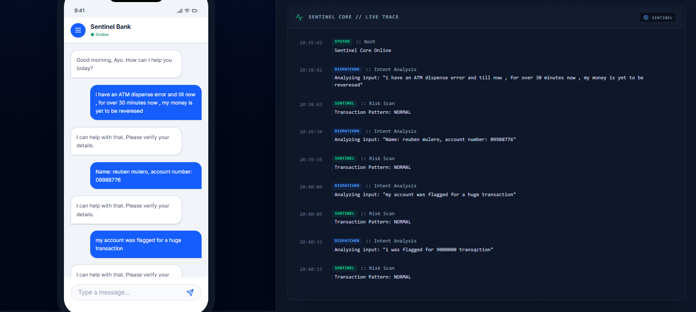

<<<<<<< HEAD
# Sentinel Bank — AI-Powered Banking System

A full-stack banking backend powered by FastAPI, PostgreSQL, and AI agents for fraud detection, complaint routing, and financial personalization.

---

### AI-Driven Agents

| Agent                | Role                                                       |
| -------------------- | ---------------------------------------------------------- |
| **Sentinel Agent**   | Real-time Fraud/Risk assessment for every transaction      |
| **Dispatcher Agent** | Routes complaints using AI sentiment & priority analysis   |
| **Trajectory Agent** | AI-Powered financial advisor & spending future-forecasting |

### Core Banking Features

- **Authentication**: JWT-based login with OTP verification and Magic Link support.
- **Transactions**: Secure internal transfers with database-level locking and risk scoring.
- **Reporting**: Ability to report failed transactions and track status via unique IDs.
- **Profile**: Full user profile management, security preferences, and theme settings.

---

## Tech Stack

| Layer         | Technology                         |
| ------------- | ---------------------------------- |
| API Framework | FastAPI (Python)                   |
| Database      | PostgreSQL on Aiven (cloud-hosted) |
| ORM           | SQLAlchemy (async)                 |
| AI Agents     | LangChain + LangGraph              |
| Auth          | JWT (Jose) + bcrypt                |
| Vector Store  | ChromaDB (RAG pipeline)            |

---

## Project Structure

```
Sentinnel_bank_project/
├── Backend/               ← API layer (endpoints, models, auth)
│   ├── app.py             ← Main FastAPI app
│   ├── api.py             ← Auth routes
│   ├── models.py          ← SQLAlchemy DB models
│   ├── schemas.py         ← Pydantic request/response schemas
│   ├── database.py        ← Async DB connection
│   ├── middleware.py      ← JWT token guard
│   └── auth.py            ← Password hashing & JWT helpers
│
├── app/
│   ├── agents/            ← AI agents (sentinel, dispatcher, trajectory)
│   ├── prompts/           ← LLM system prompts
│   └── core/              ← LangGraph orchestrator
│
├── database/
│   ├── create_schema.py   ← Creates all DB tables on Aiven
│   └── README.md          ← Database setup guide
│
├── WORK_DISTRIBUTION.md   ← Team task assignments
├── ONBOARDING.md          ← Setup guide for new teammates
├── .env.example           ← Environment variable template
└── requirements.txt       ← Python dependencies
=======
 <!-- HEAD -->
# Sentinnel Banking

## Executive Summary

Sentinnel Banking is a multi-agent artificial intelligence system designed to enhance operational efficiency, risk management, and customer experience within a digital banking environment.

The system automates three core banking functions:

| Agent                | Function                                        |
| -------------------- | ----------------------------------------------- |
| **Dispatcher Agent** | Complaint classification & department routing   |
| **Sentinel Agent**   | Evaluates transactions using a hybrid model that| 
|                      | combines machine learning with policy-based risk| 
|                      | controls and channel-aware safeguards.          |
| **Trajectory Agent** | Recommends eligible financial products based on |
|                      | structured eligibility rules, affordability     |
|                      | checks, and policy validation.                  |

Sentinnel Banking is built with a governance-first architecture. Decision-making is handled by deterministic engines and structured rules. Machine learning enhances fraud detection but does not override policy safeguards. Language models are used strictly to generate clear, audit-ready explanations, not to make financial decisions.

Key characteristics of the system include:

- Policy-aligned decision frameworks
- Hybrid fraud detection (machine learning + rule-based controls)
- Channel-aware risk assessment
- Structured logging for audit traceability
- Modular multi-agent orchestration

All data used in development is synthetic and designed to simulate real banking workflows without exposing sensitive information.
Sentinnel Banking demonstrates how artificial intelligence can be deployed responsibly within financial systems; balancing automation, explainability, and governance.


# 1. Overview

## Multi-Agent AI System for Intelligent Banking Operations

Sentinnel Banking is a modular multi-agent AI system designed to automate core banking workflows using deterministic logic, machine learning, and policy-grounded reasoning.

The system is structured around three operational domains:

* Complaint Routing
* Fraud Detection
* Product Recommendation

It combines structured decision engines with governance-safe explanation layers.

---

# 2. System Architecture


---

# 3. Core Design Philosophy

Sentinnel Banking is built on a layered architecture:

1. Deterministic Decision Engines
2. Machine Learning (Fraud Probability)
3. Policy Grounding via RAG
4. Schema-Constrained LLM Explanations
5. Structured Logging

LLMs do not make decisions.
They explain decisions made by deterministic engines.

---

# 4. Agents

## Dispatcher Agent

Purpose: Complaint classification and department routing.

* Semantic + keyword routing
* SLA classification
* Department mapping
* Policy-grounded explanation

---

## Sentinel Agent

Purpose: Fraud risk scoring and action mapping.

Sentinel uses a hybrid fraud architecture:

### Fraud Pipeline

Transaction
→ Behavioral Feature Engineering
→ ML Fraud Probability
→ Policy Risk Scoring
→ Channel Risk Assessment
→ Final Risk Score
→ Action (Approve / Challenge / Block)

### ML Integration

The fraud model:

* Learns behavioral transaction patterns
* Outputs `ml_probability`
* Detects anomalies beyond static rules
* Contributes to hybrid risk score

### Channel Risk Layer

After ML scoring, Sentinel evaluates transaction channel:

* ATM
* POS
* Web
* Mobile

Channel context can escalate actions even when ML probability is moderate.

This ensures channel-aware fraud governance.

---

## Trajectory Agent

Purpose: Product recommendation and eligibility validation.

Trajectory uses:

* Deterministic recommendation engine
* Loan signal score thresholds
* DSR validation (33.3% cap)
* Policy validation via RAG
* Structured LLM explanation

It does not rely on ML.

---

# 5. RAG Policy Engine

The system uses:

* ChromaDB
* SentenceTransformers embeddings
* Policy chunk retrieval
* Grounded validation

RAG is used to validate:

* Complaint routing categories
* Product eligibility compliance

RAG does not override deterministic logic.

---

# 6. Machine Learning Component

ML is integrated only in the Sentinel Agent.

Model outputs:

* Fraud probability (0-1)

Used to:

* Enhance anomaly detection
* Influence hybrid risk scoring
* Improve fraud sensitivity

Final decision remains policy-controlled.

---

# 7. Logging & Traceability

Every agent decision is logged in structured JSON format:

* reasoning.log
* system.log

Each entry includes:

* Timestamp
* Agent name
* Full decision payload

This enables audit traceability.

---

# 8. Project Structure

```
app/
├── agents/
├── core/
├── dataset/
├── evaluation/
├── logs/
├── prompts/
├── rag/
├── utils/
>>>>>>> f54b56f1e5309bc861498ceffd38728d9d5dff51
```

---

<<<<<<< HEAD
## Getting Started

### 1. Clone and set up environment

```bash
git clone https://github.com/Cunyie08/genai_sentinel_banking_integration.git
cd genai_sentinel_banking_integration

python -m venv .venv
.venv\Scripts\activate        # Windows
source .venv/bin/activate     # Mac/Linux

pip install -r requirements.txt
```

### 2. Configure environment variables

```bash
cp .env.example .env
```

Fill in your credentials (get from TunjiPaul privately):

- `DB_PASSWORD` — Aiven database password
- `DATABASE_URL` — Full asyncpg connection string
- `SECRET_KEY` — JWT signing key

### 3. Run the server

```bash
# Start the backend server
python -m Backend.app
```

API docs available at: [http://localhost:8000/docs](http://localhost:8000/docs)

---

## Database

16 tables on Aiven PostgreSQL. See [`database/README.md`](database/README.md) for the full schema and setup instructions.

---

## Team

| Person             | Role                                            |
| ------------------ | ----------------------------------------------- |
| **[TunjiPaul](https://github.com/tunjipaul)** | Database Schema + Auth + User Profile endpoints |
| **[Mr Opnex](https://github.com/opnex)** | Accounts + Cards + Notifications                |
| **[Halimat](https://github.com/halimahAkinoso)** | Transactions (Extended) + Settings              |
| **[Barrister Femi](https://github.com/Femilearnsai)** | Quick Services + Admin + Audit                  |
| **[David Ekpo](https://github.com/david4129)** | Backend Foundation + Trajectory Agent           |

See [`WORK_DISTRIBUTION.md`](WORK_DISTRIBUTION.md) for full task breakdown and [`ONBOARDING.md`](ONBOARDING.md) for setup instructions.
=======
# 9. Technology Stack

* Python 3.13
* AsyncIO
* ChromaDB
* SentenceTransformers
* OpenAI API
* Gemini API
* Pydantic
* Structured logging

---

# 10. Synthetic Data Engine

Synthetic datasets include:

* Customers
* Accounts
* Transactions
* Complaints

Used to simulate:

* Behavioral fraud patterns
* Loan signal scoring
* Eligibility scenarios

No real customer data is used.

---

# 11. Running the System

```bash
python -m main
```

Supported request types:

```json
{
  "type": "complaint",
  "complaint_id": "..."
}
```

```json
{
  "type": "transaction",
  "transaction_id": "..."
}
```

```json
{
  "type": "recommendation",
  "customer_id": "..."
}
```

---

# 12. Meet the Team

### AI Engineers

* Kanyisola Fagbayi
* Blessing James
* David Ekpo
* Hassan Majaro

### AI Developers

* Tunji Paul Ogor
* Reuben Mulero
* Itunu Bisayo
* Opeyemi Thomas
* Halimah Akinoso

---

# Summary

Sentinnel Banking demonstrates and reflects a modular, explainable approach to intelligent banking automation through:

* Multi-agent orchestration
* Hybrid ML + deterministic fraud detection
* Policy-grounded validation
* Channel-aware risk assessment
* Governance-safe explanation architecture
* Structured audit logging



 843f8a6 (updated functional client interface)
>>>>>>> f54b56f1e5309bc861498ceffd38728d9d5dff51
